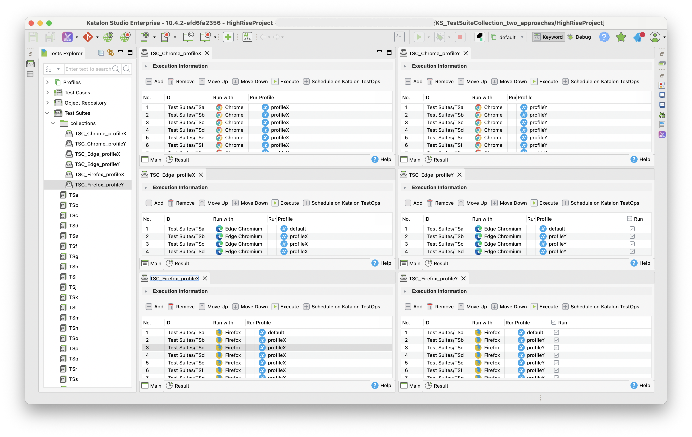
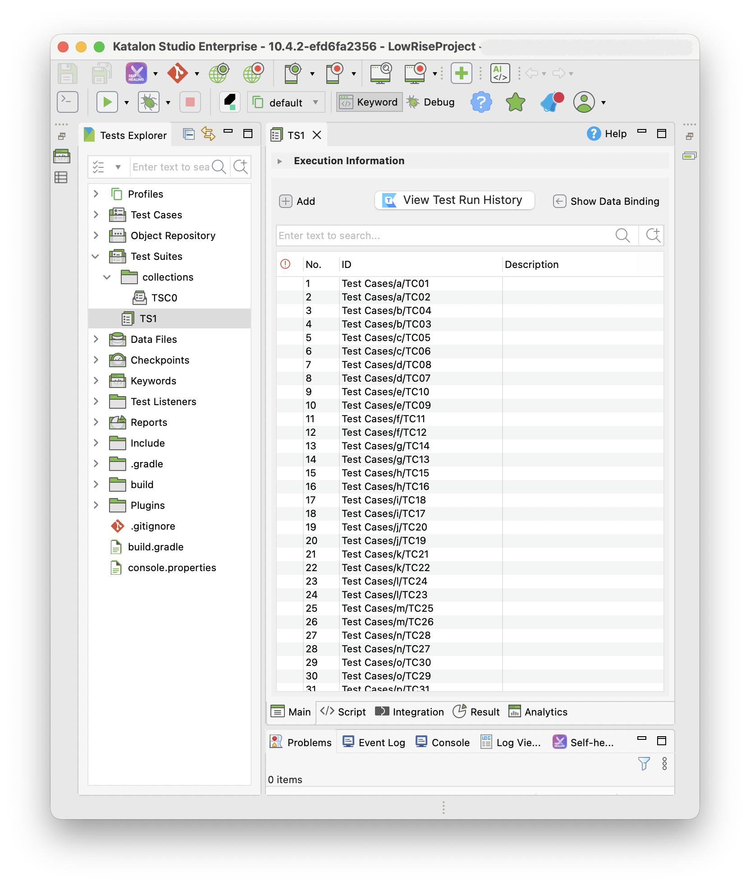
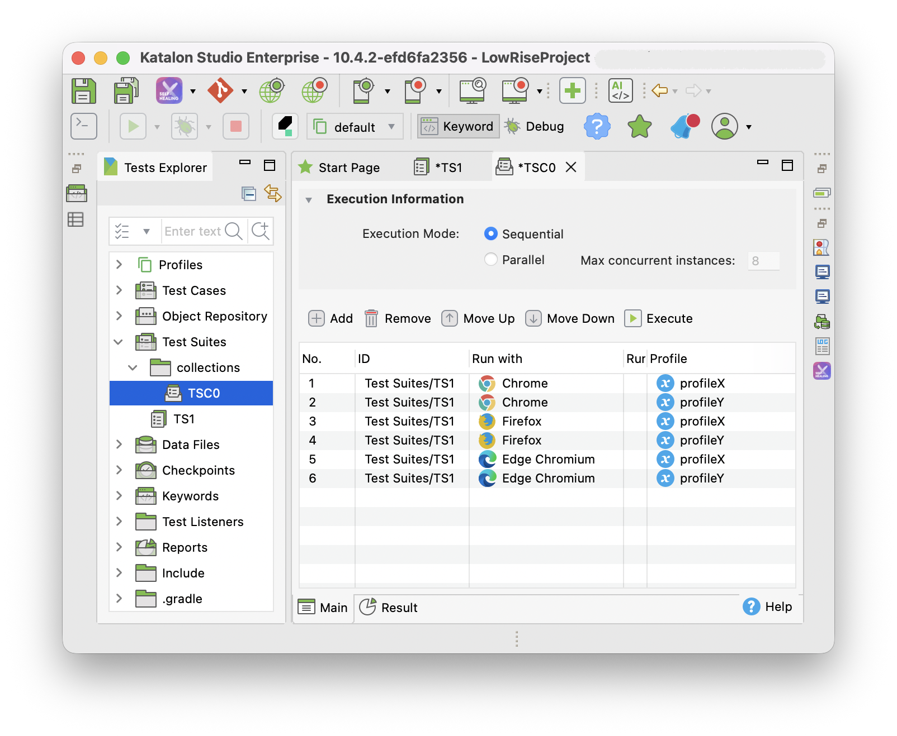

# \[Katalon Studio\] 2 approaches how to compose Test Suite Collections

I made this repository to present my thought about a topic in the Katalon Community Forum:

- <https://forum.katalon.com/t/multiple-profile-selection-and-run-with-option-should-be-given-in-test-collection/189009>

Let me quote the original post here for reference:

> In Katalon Studio, once the number of test, and suite increases and we have collection to execute, but just image if you have &gt;100 or 200 suite clubbed under a collection and now you decide to change the “Profile” and “Run with” option for each then you don’t have other option than becoming frustrated and do change them one-by-one.
> Why would one have to click each and select the option, there should be select all option as well
>
> Solution needed-: If the option of select box for one or many in one go is provided, it will be just like a magic moment.
>
> Select all option needed
>
> <figure>
> 
> </figure>
>
> Currently in my local I am using 10.2.4 verison itself, need to upgrade to the latest version, I am not sure whether the newer version got this feature or not.
> I started using Version 11.0.0 but was facing some issue, and due to client deliverables were pending to I bounce back to the older version.
>
> Regards,
> Arvind Kumar C

## Reproducing the original post

I wanted to see the project that the original poster discussed about. However he doesn’t disclosed it. Therefore I made a mimic project named **HighRiseProject"**, which is published at the following URL:

- <https://github.com/kazurayam/KS_TestSuiteCollection_two_approaches/tree/master/HighRiseProject>

The HighRiseProject contains 40 Test Cases:

    $ ls "HighRiseProject/Test Cases"
    TC01.tc TC04.tc TC07.tc TC10.tc TC13.tc TC16.tc TC19.tc TC22.tc TC25.tc TC28.tc TC31.tc TC34.tc TC37.tc TC40.tc
    TC02.tc TC05.tc TC08.tc TC11.tc TC14.tc TC17.tc TC20.tc TC23.tc TC26.tc TC29.tc TC32.tc TC35.tc TC38.tc
    TC03.tc TC06.tc TC09.tc TC12.tc TC15.tc TC18.tc TC21.tc TC24.tc TC27.tc TC30.tc TC33.tc TC36.tc TC39.tc

The HighRiseProject contains 20 Test Suites:

    $ ls "HighRiseProject/Test Suites" | grep .ts
    TSa.ts
    TSb.ts
    TSc.ts
    TSd.ts
    TSe.ts
    TSf.ts
    TSg.ts
    TSh.ts
    TSi.ts
    TSj.ts
    TSk.ts
    TSl.ts
    TSm.ts
    TSn.ts
    TSo.ts
    TSp.ts
    TSq.ts
    TSr.ts
    TSs.ts
    TSt.ts

The Test Suite `TSa` contains 2 Test Cases `TC01` and `TC02`. The Test Suite `TSb` contains `TC03` and `TC04`. The Test Suite `TSc` contains `TC05` and `TC06` …​ and so on.

The HighRiseProject contains 6 Test Suite Collections:

    $ ls "HighRiseProject/Test Suites/collections" | grep .ts
    TSC_Chrome_profileX.ts
    TSC_Chrome_profileY.ts
    TSC_Edge_profileX.ts
    TSC_Edge_profileY.ts
    TSC_Firefox_profileX.ts
    TSC_Firefox_profileY.ts

Each Test Suite contains the 20 Test Suites while the **Run with** parameter is given with a value either of `Chrome`, `Edge Chromium`, `Firefox`; and the **Profile** paramter is given with a value either of `profileX`, `profileY`. See the following screenshot where you can see how the 6 Test Suites Collections are composed.

<figure>

</figure>

## Alternative approach

I made one more project named **LowRiseProject**, which is published at the following URL:

- <https://github.com/kazurayam/KS_TestSuiteCollection_two_approaches/tree/master/LowRiseProject>

The LowRiseProject also contains 40 Test Cases enclosed under 20 folders:

    $ tree "LowRiseProject/Test Cases"
    LowRiseProject/Test Cases
    ├── a
    │   ├── TC01.tc
    │   └── TC02.tc
    ├── b
    │   ├── TC03.tc
    │   └── TC04.tc
    ├── c
    │   ├── TC05.tc
    │   └── TC06.tc
    ├── d
    │   ├── TC07.tc
    │   └── TC08.tc
    ├── e
    │   ├── TC09.tc
    │   └── TC10.tc
    ├── f
    │   ├── TC11.tc
    │   └── TC12.tc
    ├── g
    │   ├── TC13.tc
    │   └── TC14.tc
    ├── h
    │   ├── TC15.tc
    │   └── TC16.tc
    ├── i
    │   ├── TC17.tc
    │   └── TC18.tc
    ├── j
    │   ├── TC19.tc
    │   └── TC20.tc
    ├── k
    │   ├── TC21.tc
    │   └── TC22.tc
    ├── l
    │   ├── TC23.tc
    │   └── TC24.tc
    ├── m
    │   ├── TC25.tc
    │   └── TC26.tc
    ├── n
    │   ├── TC27.tc
    │   └── TC28.tc
    ├── o
    │   ├── TC29.tc
    │   └── TC30.tc
    ├── p
    │   ├── TC31.tc
    │   └── TC32.tc
    ├── q
    │   ├── TC33.tc
    │   └── TC34.tc
    ├── r
    │   ├── TC35.tc
    │   └── TC36.tc
    ├── s
    │   ├── TC37.tc
    │   └── TC38.tc
    └── t
        ├── TC39.tc
        └── TC40.tc

The LowRiseProject contains only 1 Test Suite named `TS0` which binds the 40 Test Cases.

<figure>

</figure>

The LowRiseProject contains only 1 Test Suite Collection: `TSC0`:

The `TSC0` defines 6 invokation of the `TS1`. Each invokation is given with unique combination of the "Run with" parameter and the "Profile" parameter.

## Discussion

The HighRiseProject contains 40 Test Cases. The LowRiseProject also contains 40 Test Cases. These 2 projects are equally large enough.

The HighRiseProject was very difficult to make. It was tiring to create 40 Tests Suites and 6 Test Suite Collections.

The LowRiseProject equips only 1 Test Suite `TS1` and 1 Test Suite Collection `TSC0`. The `TSC0` invokes the `TS1` 6 times with different combination of **Run with** parameter and **Profile** parameter.

In my humble opinion, the approach of the LowRiseProject is ordinary. I believe that the Katalon originally designed the product with the approach of the LowRiseProject in mind.

In my humbole opinion, the approach of the HighRiseProject is extraordinary. You should not take this approach. If you have got a project already high rise, then I would recommend you to reform your project to bring it low rise.

## Appendics

### Terminologies

- [low rise building](https://en.wikipedia.org/wiki/Low-rise_building)

- [high rise building](https://en.wikipedia.org/wiki/Tower_block)
